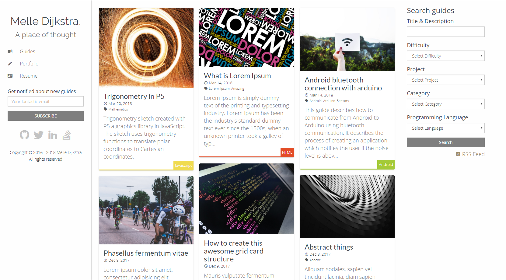
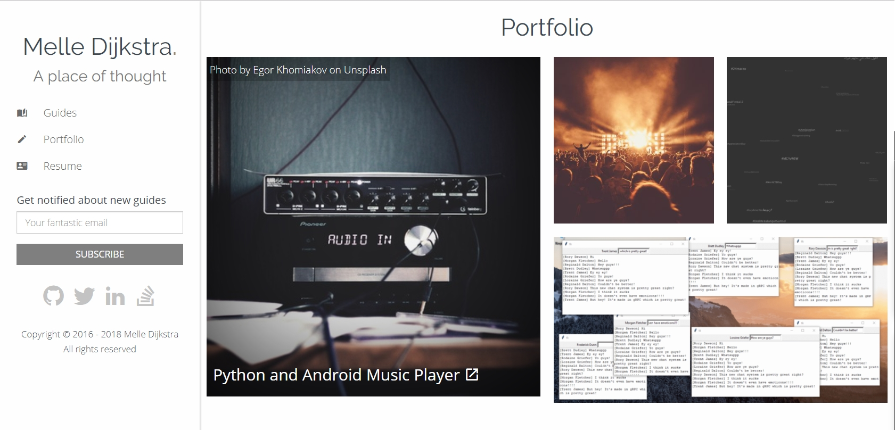
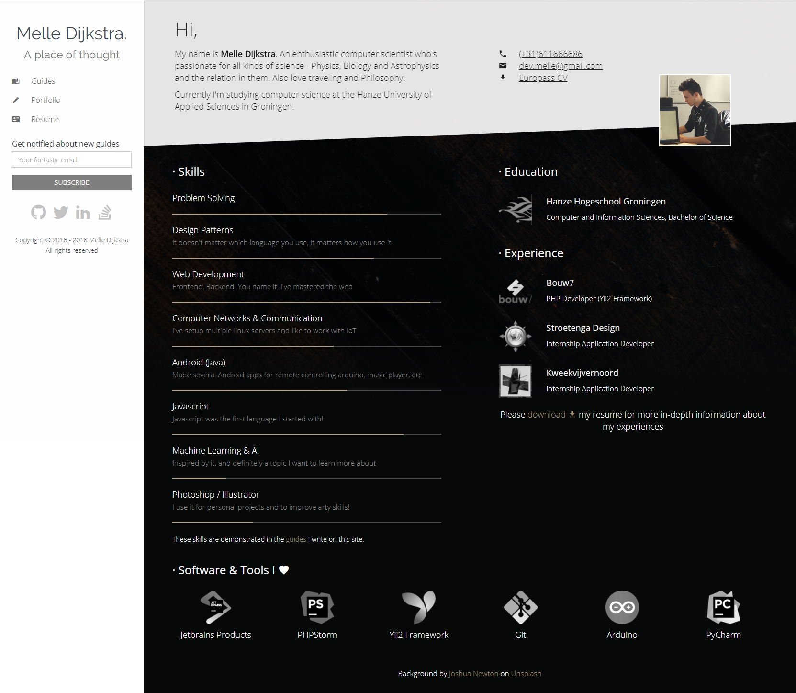

# Melle Dijkstra's personal website

This repository contains the official source code used for my personal website
Copyright © 2016 - 2018 Melle Dijkstra, All rights reserved

## Impression

Guides overview page where I display my latest written guides/articles.
It uses a [masonry layout](https://masonry.desandro.com/), which is a javascript library
that places the elements in optimal position based on available vertical space. 

Portfolio page

Resume page

